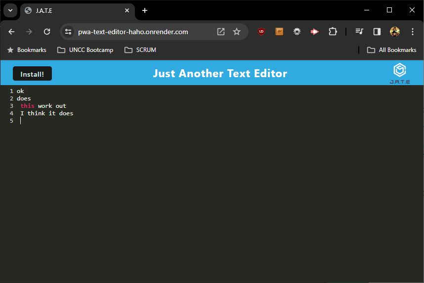

# pwa-text-editor
Challenge 19: Text Editor progressive web application

# Description
This application is a Progressive Web Application (PWA) that lets you record notes and saves them to the local database in the browser by utilizing IndexedDB and a NPM package IDB to access.

# Installation
1. Visit the [GitHub Repo](https://github.com/CLTJared/pwa-text-editor)
2. Clone the files to your local machine
    * `git clone git@github.com:CLTJared/pwa-text-editor.git`
3. From the root directory, run `npm install`
4. Once complete, run `npm run start`

## Usage
Open your web browser and navigate to `localhost:3000` with the server running. Type your notes in the browser window. When you finish, notes are automatically saved to the local storage/indexeddb and will return when you next visit.

You can also install the PWA by clicking on the install button in the browser window while using Google Chrome or other browsers that support PWAs.

# Technologies Used
* Webpack
* Workbox
* Concurrently
* IndexedDB (via idb)
* Express
* NodeJS
* Babel

## Screenshot

## Demo
[View on Render](https://pwa-text-editor-haho.onrender.com/)